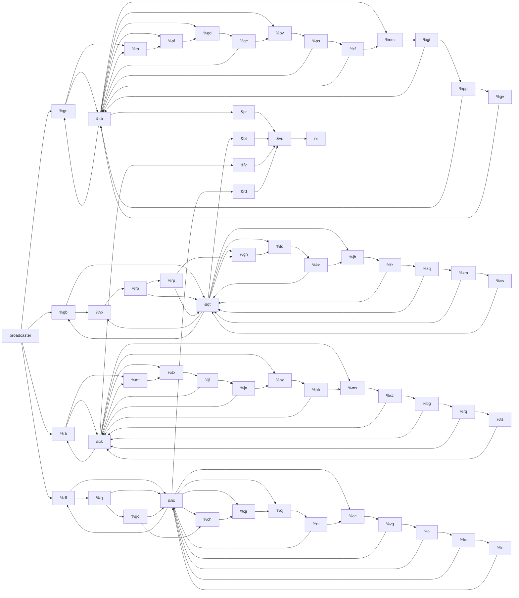

```mermaid
graph LR
    broadcaster[broadcaster] --> gn
    broadcaster[broadcaster] --> gb
    broadcaster[broadcaster] --> rb
    broadcaster[broadcaster] --> df
    gn[%gn] --> kb
    gn[%gn] --> tn
    gb[%gb] --> vx
    gb[%gb] --> qt
    rb[%rb] --> ck
    rb[%rb] --> mt
    df[%df] --> hc
    df[%df] --> lq
    kb[&kb] --> pv
    kb[&kb] --> pr
    kb[&kb] --> tn
    kb[&kb] --> nm
    kb[&kb] --> pf
    kb[&kb] --> gn
    kb[&kb] --> gd
    tn[%tn] --> pf
    vx[%vx] --> fp
    qt[&qt] --> jb
    qt[&qt] --> vx
    qt[&qt] --> bt
    qt[&qt] --> gh
    qt[&qt] --> td
    qt[&qt] --> gb
    ck[&ck] --> nz
    ck[&ck] --> fv
    ck[&ck] --> rb
    ck[&ck] --> sx
    ck[&ck] --> ms
    ck[&ck] --> mt
    mt[%mt] --> sx
    hc[&hc] --> qr
    hc[&hc] --> ch
    hc[&hc] --> df
    hc[&hc] --> dj
    hc[&hc] --> cc
    hc[&hc] --> rd
    lq[%lq] --> gq
    lq[%lq] --> hc
    pv[%pv] --> ps
    nm[%nm] --> gt
    pf[%pf] --> gd
    gd[%gd] --> gc
    fp[%fp] --> rp
    fp[%fp] --> qt
    jb[%jb] --> fz
    gh[%gh] --> td
    td[%td] --> kz
    nz[%nz] --> hh
    sx[%sx] --> jl
    ms[%ms] --> xz
    qr[%qr] --> dj
    ch[%ch] --> qr
    dj[%dj] --> nl
    cc[%cc] --> vg
    gq[%gq] --> hc
    gq[%gq] --> ch
    ps[%ps] --> kb
    ps[%ps] --> rf
    gt[%gt] --> pp
    gt[%gt] --> kb
    gc[%gc] --> kb
    gc[%gc] --> pv
    rp[%rp] --> qt
    rp[%rp] --> gh
    fz[%fz] --> qt
    fz[%fz] --> zq
    kz[%kz] --> jb
    kz[%kz] --> qt
    hh[%hh] --> ck
    hh[%hh] --> ms
    jl[%jl] --> ck
    jl[%jl] --> jn
    xz[%xz] --> ck
    xz[%xz] --> bg
    nl[%nl] --> cc
    nl[%nl] --> hc
    vg[%vg] --> fr
    vg[%vg] --> hc
    rf[%rf] --> kb
    rf[%rf] --> nm
    pp[%pp] --> gv
    pp[%pp] --> kb
    zq[%zq] --> qt
    zq[%zq] --> xm
    jn[%jn] --> ck
    jn[%jn] --> nz
    bg[%bg] --> ck
    bg[%bg] --> rq
    fr[%fr] --> ks
    fr[%fr] --> hc
    gv[%gv] --> kb
    xm[%xm] --> qt
    xm[%xm] --> cs
    rq[%rq] --> ck
    rq[%rq] --> ts
    ks[%ks] --> lc
    ks[%ks] --> hc
    cs[%cs] --> qt
    ts[%ts] --> ck
    lc[%lc] --> hc

    pr[&pr] --> vd
    bt[&bt] --> vd
    fv[&fv] --> vd
    rd[&rd] --> vd

    vd[&vd] --> rx
```